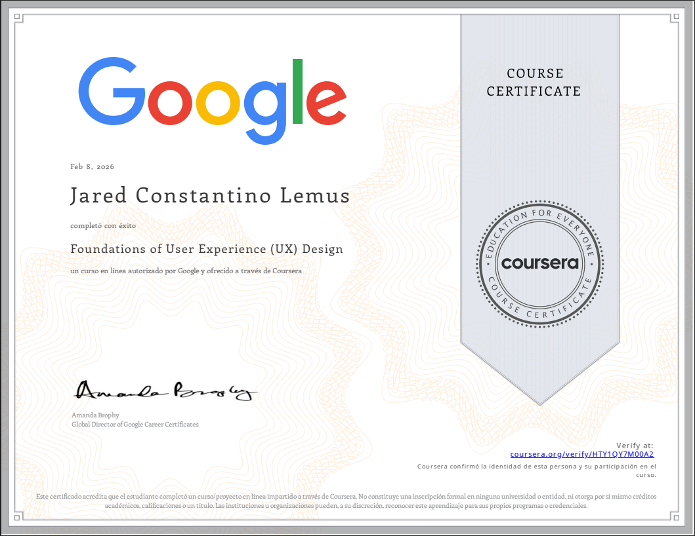

# Hi there, I'm a Jared Constantino a Computer Systems Engineering Student! 👋

I'm currently pursuing my degree in **Computer Systems Engineering** at the **Universidad Autónoma de Tamaulipas (UAT)**. I am passionate about software development, with a strong focus on Backend architecture and a deep interest in Artificial Intelligence.

---

### 🧐 About Me

- 🎓 **Education:** Computer Systems Engineering Student at [UAT](https://www.uat.edu.mx/).
- 🗣️ **Languages:** Native Spanish | English **(B2 Level)**.
- 🔭 **Current Interest:** Exploring **Artificial Intelligence** models and their integration with robust backend systems.
- ⚡ **Passion:** I love building scalable and efficient **Backend** solutions.

---

### 🛠️ Tech Stack & Favorites

I enjoy working with a variety of languages, but these are my top picks:

  
  
  
  

---

### 🚀 What I'm working on
- Designing efficient APIs and database structures.
- Learning about AI/ML algorithms and implementation.
- Strengthening my skills in system architecture and performance optimization.

---

### Certifications

---

  <i>"Code is like humor. When you have to explain it, it’s bad."</i>

